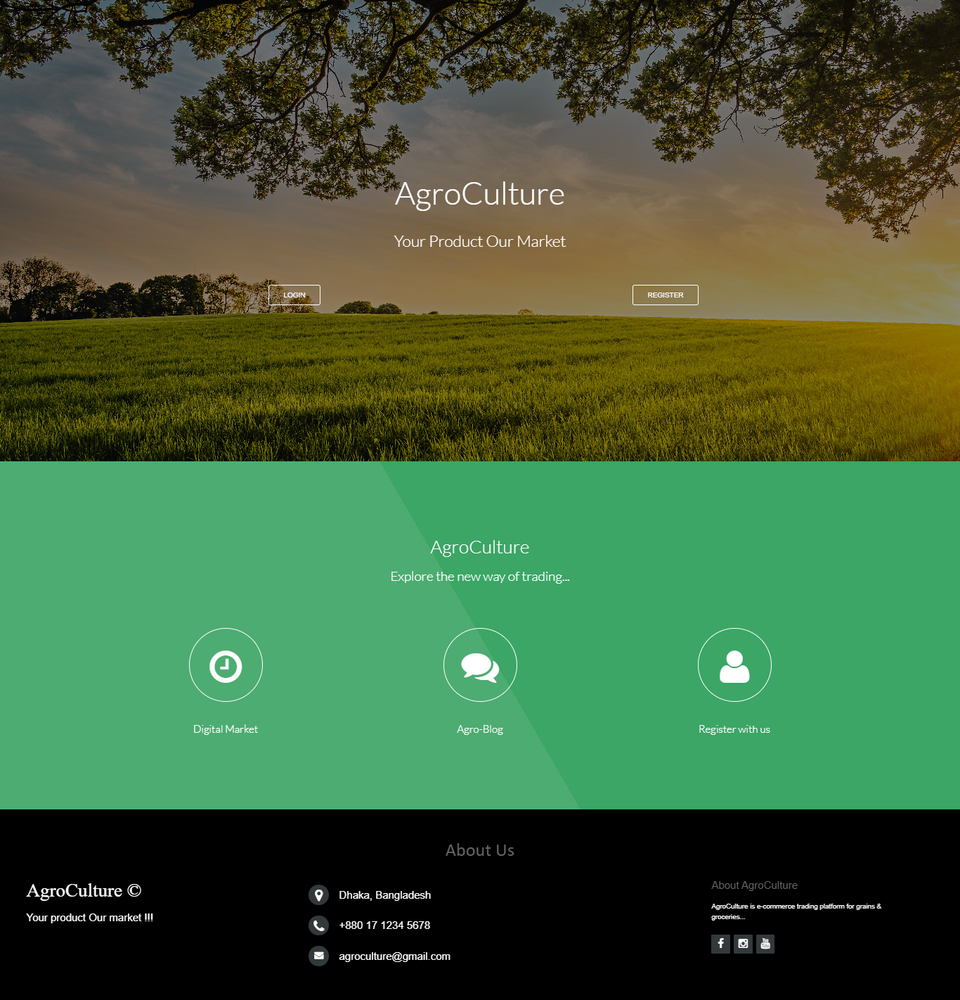
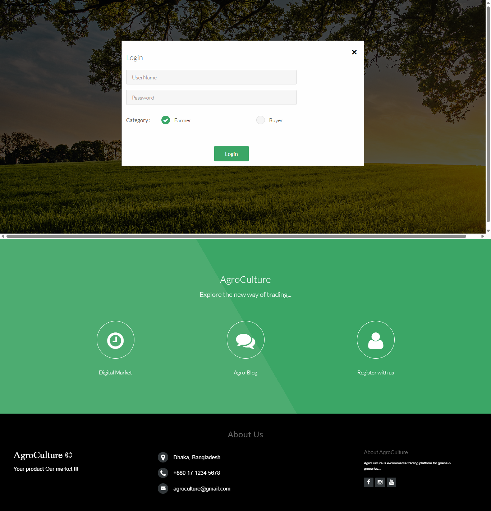
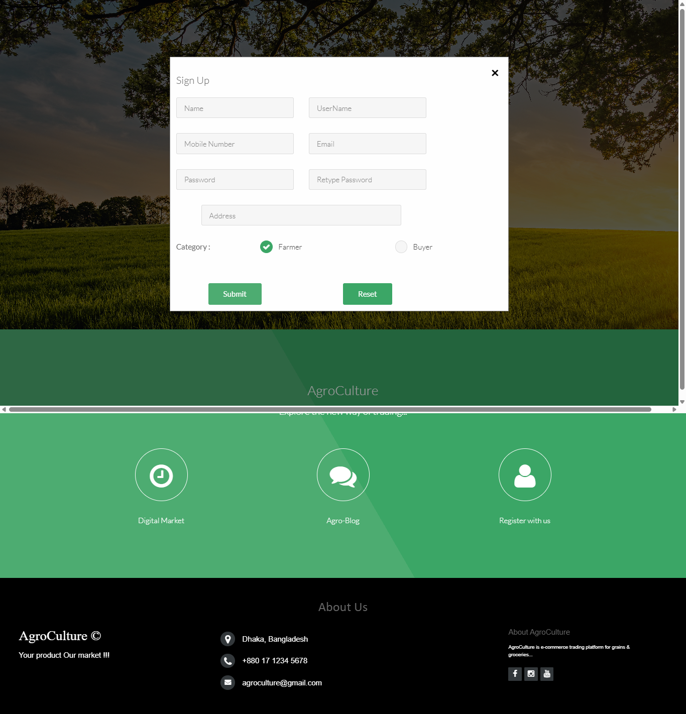
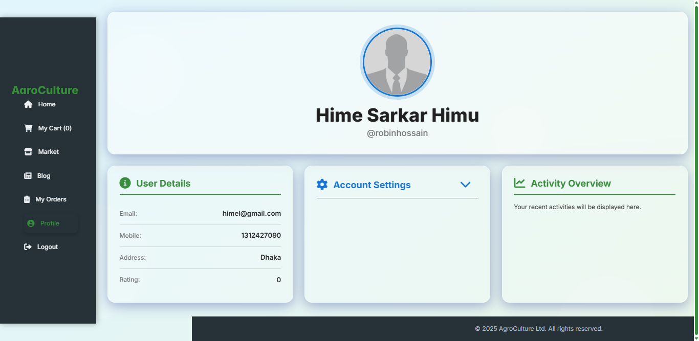
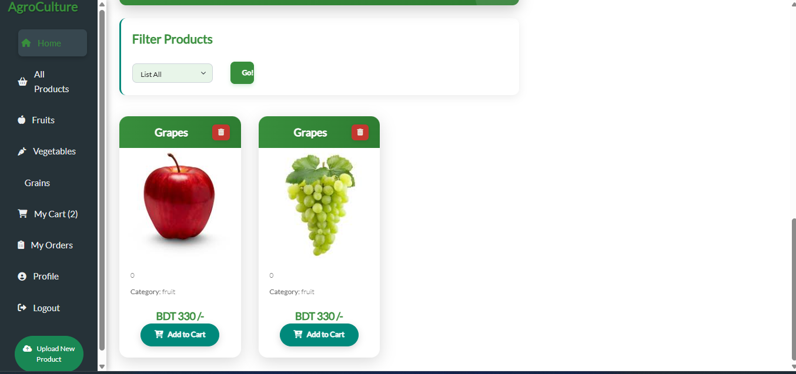
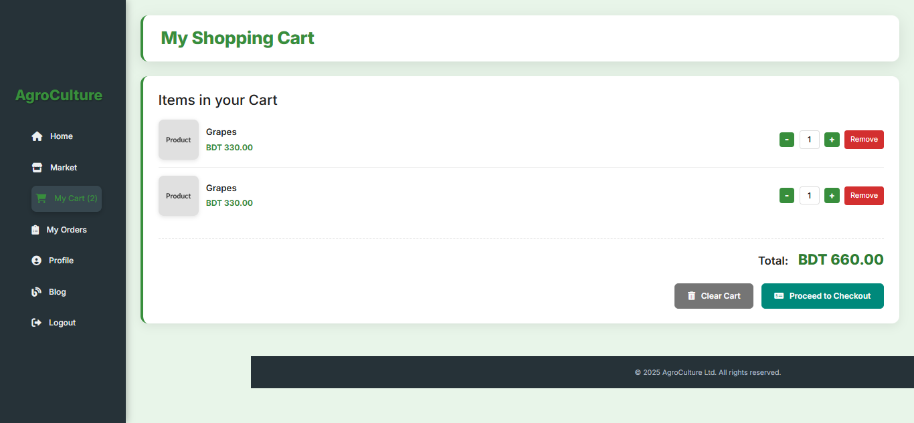
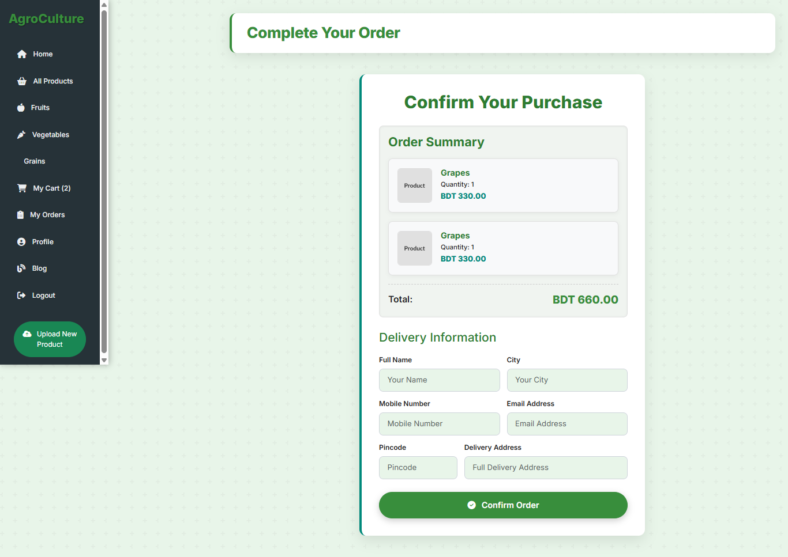

  <h1>🌾 AgroCulture Management System</h1>
  
<em>A Web-Based PHP Application Connecting Farmers and Buyers for an Improved Agriculture Marketplace</em>

---

  <h2>📌 Overview</h2>
  

    <strong>AgroCulture Management System</strong> is a dynamic web application developed using <b>PHP, HTML, CSS, and MySQL</b>.
    It aims to build a bridge between <b>farmers</b> and <b>buyers</b> by providing a digital marketplace where agricultural products can be easily shared, purchased, and managed online.
      
    📚 <strong>Educational Purpose:</strong> This project was developed as part of a B.Sc. Engineering (CSE) university course and is open-source for students to learn, explore, and enhance their web development skills.
  

---

  <h2>✨ Key Features</h2>
  <ul>
    <li><strong>👨‍🌾 Farmer & Buyer Accounts:</strong> Separate registration and login system for farmers and buyers</li>
    <li><strong>🛒 Product Upload & Purchase:</strong> Farmers can upload items, and buyers can order them directly</li>
    <li><strong>💬 Blog & Review System:</strong> Share agricultural insights and feedback within the platform</li>
    <li><strong>📦 Shopping Cart:</strong> Add, remove, and manage selected products before ordering</li>
    <li><strong>👤 Profile Management:</strong> Update profile, password, and profile picture anytime</li>
    <li><strong>✅ Order Management:</strong> Place and view orders with details</li>
    <li><strong>📱 Responsive Interface:</strong> Optimized for all screen sizes</li>
  </ul>

---

  <h2>🛠️ Technologies Used</h2>
  <table>
    <thead>
      <tr>
        <th>Technology</th>
        <th>Purpose</th>
      </tr>
    </thead>
    <tbody>
      <tr><td><strong>PHP</strong></td><td>Server-side scripting and backend logic</td></tr>
      <tr><td><strong>HTML5</strong></td><td>Frontend structure</td></tr>
      <tr><td><strong>CSS3</strong></td><td>Styling and responsive layout</td></tr>
      <tr><td><strong>MySQL</strong></td><td>Database management</td></tr>
      <tr><td><strong>XAMPP</strong></td><td>Local server for Apache and MySQL</td></tr>
    </tbody>
  </table>

---

  <h2>🚀 Getting Started</h2>
  <ol>
    <li>📦 <strong>Clone the repository:</strong>
      <pre><code>git clone https://github.com/MossarrafHossainRobin/AgroCulture-Management-System.git</code></pre>
    </li>
    <li>📂 <strong>Move the folder</strong> to your <code>htdocs</code> directory inside the XAMPP installation.</li>
    <li>💾 <strong>Setup the Database:</strong>
      <ul>
        <li>Start <strong>Apache</strong> and <strong>MySQL</strong> from the XAMPP Control Panel.</li>
        <li>Go to <a href="http://localhost/phpmyadmin" target="_blank">phpMyAdmin</a>.</li>
        <li>Create a new database (e.g. <code>agroculture_db</code>).</li>
        <li>Import the provided SQL file from the <code>/database</code> folder.</li>
      </ul>
    </li>
    <li>🌐 <strong>Run the Project:</strong>
      <pre><code>http://localhost/AgroCulture-Management-System/</code></pre>
    </li>
  </ol>

---

  <h2>📁 Project Structure</h2>
  <pre style="font-family: monospace;">
AgroCulture-Management-System/
├── CSS/
│   ├── commentBox.css
│   ├── font-awesome.min.css
│   ├── indexFooter.css
│   ├── login.css
│   ├── skel.css
│   ├── style.css
│   ├── style-large.css
│   ├── style-medium.css
│   ├── style-small.css
│   ├── style-xlarge.css
│   └── style-xsmall.css
│
├── PHP/
│   ├── blogFeedSubmit.php
│   ├── blogSubmit.php
│   ├── blogView.php
│   ├── blogViewProcess.php
│   ├── blogWrite.php
│   ├── buyNow.php
│   ├── changePass.php
│   ├── db.php
│   ├── error.php
│   ├── index.php
│   ├── login.php
│   ├── logout.php
│   ├── market.php
│   ├── menu.php
│   ├── myCart.php
│   ├── orderdetails.php
│   ├── profile.php
│   ├── profileEdit.php
│   ├── profileView.php
│   ├── review.php
│   ├── reviewInput.php
│   ├── signUp.php
│   ├── success.php
│   ├── updatePic.php
│   ├── updateProfile.php
│   ├── uploadProduct.php
│   └── verify.php
│
└── screenshots/
    ├── home-page.png
    ├── login-page.png
    ├── registration-page.png
    ├── profile-view.png
    ├── product-card.png
    ├── cart-view.png
    └── order-now-page.png
  </pre>

---

  <h2>📸 Screenshots</h2>
  <h4>🏠 Home Page</h4>
  
  
  <h4>🔑 Login Page</h4>
  
  
  <h4>📝 Registration Page</h4>
  

  <h4>👤 Profile View</h4>
  

  <h4>🛍️ Product Card</h4>
  

  <h4>🛒 Cart View</h4>
  

  <h4>💳 Order Now Page</h4>
  

---

  <h2>❓ Frequently Asked Questions (FAQ)</h2>
  

    
<strong>Can I use this for my university project?</strong>

    
✅ Yes! This project is designed for academic and educational use.

  

  

    
<strong>Does it use a database?</strong>

    
✅ Yes, the system uses MySQL as the backend database.

  

  

    
<strong>Is it responsive?</strong>

    
✅ Yes, it works on both mobile and desktop screens using custom CSS breakpoints.

  

  

    
<strong>Can others modify or use it?</strong>

    
✅ Yes, under the MIT License — just keep credit to the original author.

  

---

  <h2>👨‍💻 Author</h2>
  <table>
    <tr>
      <td align="center" valign="top">
        <strong>Mosharruf Hossain Robin</strong> 
        🎓 B.Sc. in Computer Science & Engineering 
        Green University of Bangladesh  
        
        
        
      </td>
    </tr>
  </table>

---

  <h2>📃 License</h2>
  

    
  

  
This project is licensed under the <strong>MIT License</strong> — you are free to use, modify, and distribute it with attribution.

